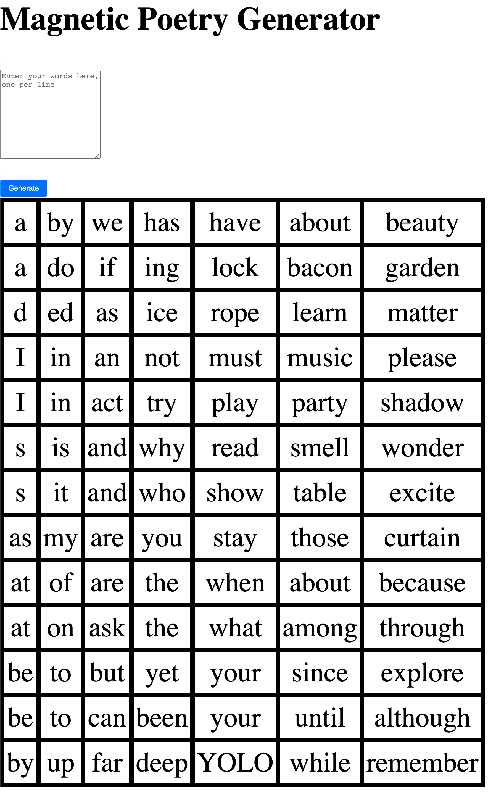

# Magnetic Poetry Generator
This is a very quick tool hacked together. It allows you to print out a table of words that can be cut out and put on magnets/velcro to make your own custom magnetic poetry board. I used this for a halloween costume.

By default, the js file has a bunch of words to use, but you can enter other words and generate a table.

There's some good starting words (and more) on this website: https://magneticpoetrymnl.com/pages/starter-kit-word-list

